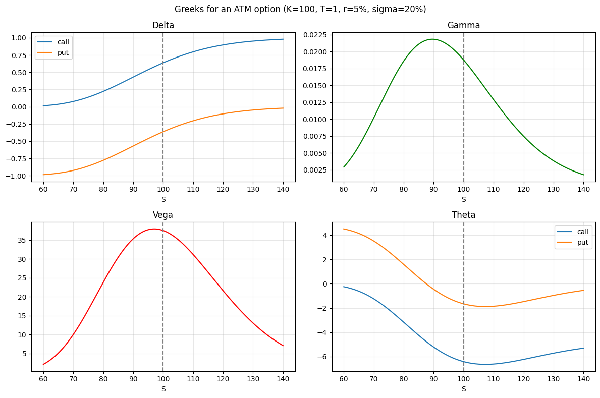
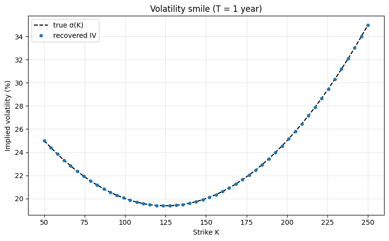
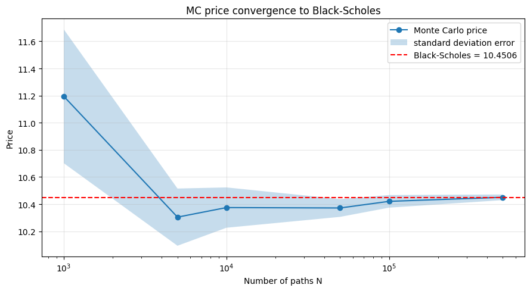
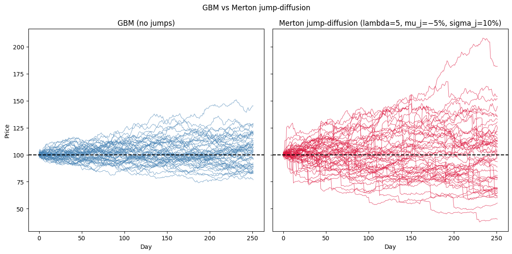
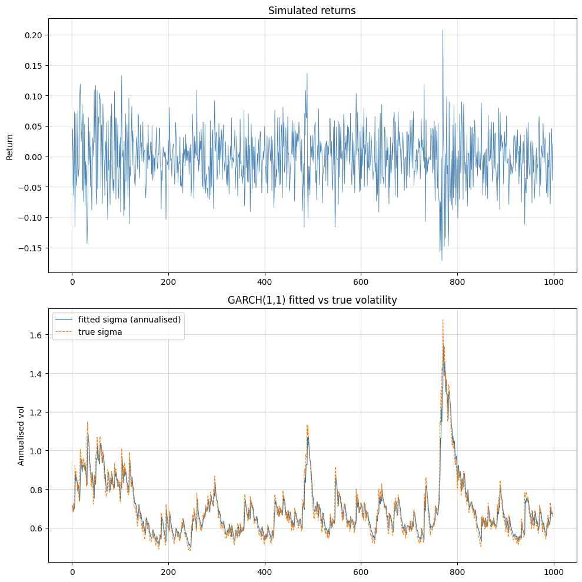

# Examples (Python)

## Options pricing with Black-Scholes

This notebook demonstrates a selection of capabilities of the
**Volaris** library:

- option pricing with the Black-Scholes model
- Greeks calculation: delta, gamma, vega, theta, rho
- fast root-finding and numerical integration through a compiled C core
- binomial tree as a discrete alternative to Black-Scholes

------------------------------------------------------------------------

``` python
import numpy as np
import matplotlib.pyplot as plt

from volaris import (
    bs_price, bs_delta, bs_gamma, bs_vega, bs_theta, bs_rho,
    binomial_price,
    rootfind_newton, rootfind_bisect,
    integrate_gauss, integrate_gsl,
    implied_vol,
)

S, K, T, r, sigma = 100.0, 100.0, 1.0, 0.05, 0.20
```

------------------------------------------------------------------------

### Black-Scholes pricing

The Black-Scholes model assumes the underlying option follows Geometric
Brownian Motion.

Variables used:

| Symbol | Meaning                                     | Example value  |
|--------|---------------------------------------------|----------------|
| S      | current price of the underlying asset       | 100.0          |
| K      | strike price (exercise price of the option) | 100.0          |
| T      | time to expiration in years                 | 1.0 (= 1 year) |
| r      | risk-free interest rate (annualised)        | 0.05 (= 5%)    |
| sigma  | volatility of the underlying (annualised)   | 0.20 (= 20%)   |
| C      | call option price: right to buy at K        | computed       |
| P      | put option price: right to sell at K        | computed       |

Call and put prices for an at-the-money option, verified via put-call
parity:

``` python
call = bs_price(S, K, T, r, sigma, 1)
put  = bs_price(S, K, T, r, sigma, 0)

print(f"Call: {call:.4f}")
print(f"Put:  {put:.4f}")

print(f"Put-call parity check: {call - put:.4f} vs {S - K * np.exp(-r * T):.4f}")
if abs((call - put) - (S - K * np.exp(-r * T))) < 1e-10:
    print("Put-call parity holds!")
```

    Call: 10.4506
    Put:  5.5735
    Put-call parity check: 4.8771 vs 4.8771
    Put-call parity holds!

------------------------------------------------------------------------

### Greeks calculation

The Greeks measure the sensitivity of the option price to market
parameters.

Below: delta, gamma, vega, and theta for call and put options as a
function of spot price S.

``` python
spots = np.linspace(60, 140, 200)

deltas_c = [bs_delta(s, K, T, r, sigma, 1) for s in spots]
deltas_p = [bs_delta(s, K, T, r, sigma, 0) for s in spots]
gammas = [bs_gamma(s, K, T, r, sigma) for s in spots]
vegas = [bs_vega(s, K, T, r, sigma) for s in spots]
thetas_c = [bs_theta(s, K, T, r, sigma, 1) for s in spots]
thetas_p = [bs_theta(s, K, T, r, sigma, 0) for s in spots]
```

``` python
fig, axes = plt.subplots(2, 2, figsize=(12, 8))

axes[0,0].plot(spots, deltas_c, label="call")
axes[0,0].plot(spots, deltas_p, label="put")
axes[0,0].set_title("Delta"); axes[0,0].legend()
axes[0,0].axvline(K, ls="--", c="gray")

axes[0,1].plot(spots, gammas, color="green")
axes[0,1].set_title("Gamma")
axes[0,1].axvline(K, ls="--", c="gray")

axes[1,0].plot(spots, vegas, color="red")
axes[1,0].set_title("Vega")
axes[1,0].axvline(K, ls="--", c="gray")

axes[1,1].plot(spots, thetas_c, label="call")
axes[1,1].plot(spots, thetas_p, label="put")
axes[1,1].set_title("Theta"); axes[1,1].legend()
axes[1,1].axvline(K, ls="--", c="gray")

for ax in axes.flat:
    ax.set_xlabel("S");
    ax.grid(alpha=0.3)

plt.suptitle("Greeks for an ATM option (K=100, T=1, r=5%, sigma=20%)")
plt.tight_layout()
plt.show()
```



png

------------------------------------------------------------------------

### Root-finding

Volaris provides two root-finding methods implemented in C.

Example: find sigma such that the BS call price equals 15. This is also
exactly what `implied_vol` does internally.

``` python
target = 15.0

f  = lambda sigma: bs_price(S, K, T, r, sigma, 1) - target
df = lambda sigma: bs_vega(S, K, T, r, sigma)

root_newton = rootfind_newton(f, df, x0=0.3)
root_bisect = rootfind_bisect(f, 0.01, 2.0)
iv = implied_vol(target, S, K, T, r, 1)

print(f"Target: {target}")
print("------------------")
print(f"Newton-Raphson:  sigma = {root_newton:.6f}  |  price = {bs_price(S, K, T, r, root_newton, 1):.6f}")
print(f"Bisection:       sigma = {root_bisect:.6f}  |  price = {bs_price(S, K, T, r, root_bisect, 1):.6f}")
print(f"Implied vol:     sigma = {iv:.6f}  |  price = {bs_price(S, K, T, r, iv, 1):.6f}")
```

    Target: 15.0
    ------------------
    Newton-Raphson:  sigma = 0.320258  |  price = 15.000000
    Bisection:       sigma = 0.320258  |  price = 15.000000
    Implied vol:     sigma = 0.320258  |  price = 15.000000

------------------------------------------------------------------------

### Numerical integration

The Black-Scholes formula is derived from an integral over the normal
distribution.

Comparison of Gauss quadrature (custom C implementation) and GSL QAGS
adaptive integration:

``` python
from math import pi, exp, sqrt

def normal_pdf(x):
   return exp(-0.5 * x * x) / sqrt(2 * pi)

a, b = -3.0, 3.0
exact = 0.9973002039  # P(-3 < Z < 3)

result_gauss = integrate_gauss(normal_pdf, a, b, n_points=20)
result_gsl = integrate_gsl(normal_pdf, a, b, tol=1e-10)

print(f"Gauss quadrature (n=20): {result_gauss:.10f}  |  error: {abs(result_gauss - exact):.2e}")
print(f"GSL QAGS:                {result_gsl:.10f}  |  error: {abs(result_gsl - exact):.2e}")
print(f"Exact value:             {exact:.10f}")
```

    Gauss quadrature (n=20): 0.9973002039  |  error: 3.67e-11
    GSL QAGS:                0.9973002039  |  error: 3.67e-11
    Exact value:             0.9973002039

------------------------------------------------------------------------

### Options pricing with a binomial tree

The Cox-Ross-Rubinstein model demonstrates Brownian motion on a binomial
tree.

As the number of steps N increases, the price converges to the
Black-Scholes analytical value:

``` python
bs_ref = bs_price(S, K, T, r, sigma, 1)
steps  = [5, 10, 20, 50, 100, 200, 500]
prices = [binomial_price(S, K, T, r, 0.0, sigma, N, 1, 0) for N in steps]
```

``` python
plt.figure(figsize=(8, 4))
plt.semilogx(steps, prices, "o-", label="Binomial tree")
plt.axhline(bs_ref, color="red", ls="--", label=f"Black-Scholes = {bs_ref:.4f}")
plt.xlabel("Number of steps N")
plt.ylabel("Call option price")
plt.title("Convergence of CRR binomial tree to Black-Scholes")
plt.legend()
plt.grid(alpha=0.3)
plt.tight_layout()
plt.show()
```


png

## Implied volatility surface & volatility calculation

This notebook demonstrates a selection of capabilities of the
**Volaris** library through:

- finding the implied volatility smile and surface via Black-Scholes
  model inversion
- volatility calculation: Close-to-Close, Parkinson, Garman-Klass,
  Yang-Zhang estimators
- comparison of estimator efficiency on simulated OHLC data

------------------------------------------------------------------------

``` python
import numpy as np
import matplotlib.pyplot as plt

from volaris import (
    bs_price, 
    hist_vol_close_to_close, hist_vol_parkinson, hist_vol_garman_klass, hist_vol_yang_zhang,
    gbm_paths,
    implied_vol,
)

S, r, sigma = 100.0, 0.05, 0.20
rng = np.random.default_rng(123)
```

------------------------------------------------------------------------

### Implied volatility smile

In the Black-Scholes world, IV should be flat across all strikes.

In practice markets show a **volatility smile**: OTM puts and calls
trade at higher IV than ATM.

| Term | Full name        | Condition (call) | Condition (put) |
|------|------------------|------------------|-----------------|
| ATM  | at-the-money     | K = S            | K = S           |
| OTM  | out-of-the-money | K \> S           | K \< S          |
| ITM  | in-the-money     | K \< S           | K \> S          |

We simulate a smile by pricing options with a strike-dependent
volatility, then recovering implied volatility from those prices using
Newton-Raphson / bisection inversion.

``` python
T = 1.0
strikes = np.linspace(50, 250, 50)

def smile_sigma(K):
    m = (K - S) / S
    return 0.20 - 0.05 * m + 0.10 * m**2

market_prices = np.array([bs_price(S, K, T, r, smile_sigma(K), 1) for K in strikes])
ivs = np.array([implied_vol(p, S, K, T, r, 1) for p, K in zip(market_prices, strikes)])
true_sigmas = np.array([smile_sigma(K) for K in strikes])
```

``` python
plt.figure(figsize=(8, 5))
plt.plot(strikes, true_sigmas * 100, "k--", label="true σ(K)")
plt.plot(strikes, ivs * 100, "o", ms=4, label="recovered IV")
plt.xlabel("Strike K")
plt.ylabel("Implied volatility (%)")
plt.title("Volatility smile (T = 1 year)")
plt.legend(); plt.grid(alpha=0.3)
plt.tight_layout()
plt.show()
```



png

------------------------------------------------------------------------

### Volatility surface

Extending the smile across multiple maturities gives a **volatility
surface**.

The term structure of volatility reflects market expectations at
different horizons.

``` python
tenors  = np.array([0.1, 0.25, 0.5, 1.0, 1.5, 2.0])
strikes_grid = np.linspace(75, 125, 30)

surface = np.zeros((len(tenors), len(strikes_grid)))

for i, T_ in enumerate(tenors):
    for j, K in enumerate(strikes_grid):
        m = (K - S) / S
        vol = 0.20 - 0.05 * m + 0.10 * m**2 + 0.02 * np.sqrt(T_)
        price = bs_price(S, K, T_, r, vol, 1 if K >= S else 0)
        surface[i, j] = implied_vol(price, S, K, T_, r, 1 if K >= S else 0)
```

``` python
KK, TT = np.meshgrid(strikes_grid, tenors)
fig = plt.figure(figsize=(8, 8))
ax = fig.add_subplot(111, projection="3d")
ax.plot_surface(KK, TT, surface * 100, cmap="viridis", alpha=0.85)
ax.set_xlabel("Strike K"); 
ax.set_ylabel("Maturity T (years)")
ax.set_zlabel("Implied vol (%)")
ax.set_title("Implied Volatility Surface")
plt.tight_layout()
plt.show()
```


png

------------------------------------------------------------------------

### Historical volatility estimators

Volaris implements four classical estimators of realised volatility, all
computed in C from OHLC (Open, High, Low, Close) price data.

| Estimator      | Uses                   |
|----------------|------------------------|
| Close-to-Close | log returns            |
| Parkinson      | High, Low              |
| Garman-Klass   | Open, High, Low, Close |
| Yang-Zhang     | Open, High, Low, Close |

We simulate 252 days of OHLC data from GBM with known sigma = 20%.

``` python
true_sigma = 0.20
N_days = 252

# Simulate intraday paths (open, high, low, close per day)

intraday_steps = 100
paths = gbm_paths(S0=100.0, mu=0.05, sigma=true_sigma, T=1.0, N_steps=N_days * intraday_steps, N_paths=1)
prices = paths[0]
days = prices.reshape(N_days, intraday_steps)
open_ = days[:, 0].copy()
close_ = days[:, -1].copy()
high_ = days.max(axis=1)
low_ = days.min(axis=1)

returns = np.diff(np.log(close_))
returns = np.ascontiguousarray(returns)
open_ = np.ascontiguousarray(open_[1:])
close_ = np.ascontiguousarray(close_[1:])
high_ = np.ascontiguousarray(high_[1:])
low_ = np.ascontiguousarray(low_[1:])
```

``` python
ctc = hist_vol_close_to_close(returns)
park = hist_vol_parkinson(high_, low_)
gk = hist_vol_garman_klass(high_, low_, open_, close_)
yz = hist_vol_yang_zhang(high_, low_, open_, close_)

print(f"True sigma:     {true_sigma:.4f}")
print("---------------")
print(f"Close-to-Close: {ctc:.4f}")
print(f"Parkinson:      {park:.4f}")
print(f"Garman-Klass:   {gk:.4f}")
print(f"Yang-Zhang:     {yz:.4f}")
```

    True sigma:     0.2000
    ---------------
    Close-to-Close: 0.1855
    Parkinson:      0.1780
    Garman-Klass:   0.1756
    Yang-Zhang:     0.1789

------------------------------------------------------------------------

### Rolling historical volatility

Computing volatility over a rolling 21-day window shows how each
estimator tracks changing market conditions over time.

``` python
window = 21
n = len(returns)

ctc_roll, park_roll, gk_roll, yz_roll = [], [], [], []

for start in range(n - window):
    sl = slice(start, start + window)
    ctc_roll.append(hist_vol_close_to_close(np.ascontiguousarray(returns[sl])))
    park_roll.append(hist_vol_parkinson(np.ascontiguousarray(high_[sl]), np.ascontiguousarray(low_[sl])))
    gk_roll.append(hist_vol_garman_klass(np.ascontiguousarray(high_[sl]), np.ascontiguousarray(low_[sl]), 
                                         np.ascontiguousarray(open_[sl]), np.ascontiguousarray(close_[sl])))
    yz_roll.append(hist_vol_yang_zhang(np.ascontiguousarray(high_[sl]), np.ascontiguousarray(low_[sl]),
                                       np.ascontiguousarray(open_[sl]), np.ascontiguousarray(close_[sl])))
```

``` python
plt.figure(figsize=(10, 5))
plt.plot(ctc_roll, label="Close-to-Close", alpha=0.7)
plt.plot(park_roll, label="Parkinson", alpha=0.7)
plt.plot(gk_roll, label="Garman-Klass", alpha=0.7)
plt.plot(yz_roll, label="Yang-Zhang", alpha=0.7)
plt.axhline(true_sigma, color="black", ls="--", label=f"True σ = {true_sigma}")
plt.xlabel("Day"); plt.ylabel("Annualised volatility")
plt.title("Rolling 21-day historical volatility (GBM simulation)")
plt.legend(); plt.grid(alpha=0.3)
plt.tight_layout()
plt.show()
```


png

## Monte Carlo pricing & stochastic simulations

This notebook demonstrates a selection of capabilities of the
**Volaris** library:

- European, Asian, and barrier option pricing via Monte Carlo simulation
- GBM path simulation with antithetic variates for variance reduction
- Merton jump-diffusion model (GBM + compound Poisson jumps)
- GARCH(1,1) volatility modelling and forecasting

------------------------------------------------------------------------

``` python
import numpy as np
import matplotlib.pyplot as plt

from volaris import (
    bs_price,
    mc_price_european, mc_price_asian, mc_price_barrier,
    gbm_paths, gbm_paths_antithetic,
    merton_paths,
    garch_fit, garch_variances, garch_forecast,
)

S, K, T, r, sigma = 100.0, 100.0, 1.0, 0.05, 0.20
```

------------------------------------------------------------------------

### European option pricing

Monte Carlo estimates the option price by simulating many asset paths
and averaging the discounted payoffs.

Comparison against the Black-Scholes analytical price:

``` python
bs_ref = bs_price(S, K, T, r, sigma, 1)

path_counts = [1_000, 5_000, 10_000, 50_000, 100_000, 500_000]
prices, errors = [], []

for N in path_counts:
    price, se = mc_price_european(S, K, T, r, sigma, N, 1)
    prices.append(price)
    errors.append(se)
```

``` python
fig, ax = plt.subplots(figsize=(9, 5))

ax.semilogx(path_counts, prices, "o-", label="Monte Carlo price")
ax.fill_between(path_counts, 
                [p - e for p, e in zip(prices, errors)],
                [p + e for p, e in zip(prices, errors)],
                alpha=0.25, label="standard deviation error")
ax.axhline(bs_ref, color="red", ls="--", label=f"Black-Scholes = {bs_ref:.4f}")
ax.set_xlabel("Number of paths N"); ax.set_ylabel("Price")
ax.set_title("MC price convergence to Black-Scholes")
ax.legend(); ax.grid(alpha=0.3)

plt.tight_layout()
plt.show()
```



png

------------------------------------------------------------------------

### Asian and barrier options

Exotic options depend on the full path, not just the terminal price:
they cannot be priced analytically with a simple closed form.

- *Asian option*: payoff based on the average price over the life of the
  option

- *Barrier option*: activated (knock-in) or deactivated (knock-out) when
  price crosses a barrier B

``` python
N_paths, N_steps = 100_000, 252
B = 120.0  # barrier level

european, _ = mc_price_european(S, K, T, r, sigma, N_paths, 1)
asian = mc_price_asian(S, K, T, r, sigma, N_paths, N_steps, 1)
knockout = mc_price_barrier(S, K, T, r, sigma, N_paths, N_steps, B, 1, 1, 1)
knockin = mc_price_barrier(S, K, T, r, sigma, N_paths, N_steps, B, 1, 0, 1)

print(f"European call:    {european:.4f}")
print(f"Asian call:       {asian:.4f}")
print(f"Up-and-out call:  {knockout:.4f}")
print(f"Up-and-in call:   {knockin:.4f}")
print(f"\nKnock-out + knock-in = {knockout + knockin:.4f}  (should more-less equal European = {european:.4f})")
```

    European call:    10.5372
    Asian call:       5.7724
    Up-and-out call:  1.3518
    Up-and-in call:   9.1257

    Knock-out + knock-in = 10.4775  (should more-less equal European = 10.5372)

------------------------------------------------------------------------

### Geometric Brownian Motion paths simulation

Simulating asset paths under Geometric Brownian Motion.

Antithetic variates pair each path with its mirror (-Z instead of Z),
reducing variance without additional model evaluations.

``` python
N_plot, N_steps = 200, 252

paths = gbm_paths(S, mu=0.05, sigma=sigma, T=1.0, N_steps=N_steps, N_paths=N_plot)
paths_anti = gbm_paths_antithetic(S, mu=0.05, sigma=sigma, T=1.0, N_steps=N_steps, N_paths=N_plot)
```

``` python
fig, axes = plt.subplots(1, 2, figsize=(12, 6), sharey=True)

for p in paths[:50]:
    axes[0].plot(p, alpha=0.7, lw=0.7, color="steelblue")
axes[0].set_title("GBM paths"); axes[0].set_xlabel("Day"); axes[0].set_ylabel("Price")
axes[0].axhline(S, ls="--", color="black")

for p in paths_anti[:50]:
    axes[1].plot(p, alpha=0.7, lw=0.7, color="darkorange")
axes[1].set_title("GBM paths: antithetic variates")
axes[1].set_xlabel("Day")
axes[1].axhline(S, ls="--", color="black")

plt.suptitle("GBM Simulation (S=100, mu=5%, sigma=20%, T=1 year)")
plt.tight_layout()
plt.show()
```


png

------------------------------------------------------------------------

### Merton jump-diffusion model

The Merton model extends GBM by adding compound Poisson jumps: sudden
large moves that GBM cannot capture.

Parameters:

| Symbol  | Meaning                           |
|---------|-----------------------------------|
| lambda  | expected number of jumps per year |
| mu_j    | mean log-jump size                |
| sigma_j | volatility of log-jump size       |

``` python
N_plot = 50

gbm_sim = gbm_paths(S, mu=0.05, sigma=0.15, T=1.0, N_steps=252, N_paths=N_plot)
merton_sim = merton_paths(S, mu=0.05, sigma=0.15, lambda_=5.0, mu_j=-0.05, 
                          sigma_j=0.10, T=1.0, N_steps=252, N_paths=N_plot)
```

``` python
fig, axes = plt.subplots(1, 2, figsize=(12, 6), sharey=True)

for p in gbm_sim:
    axes[0].plot(p, alpha=0.7, lw=0.7, color="steelblue")
axes[0].set_title("GBM (no jumps)"); axes[0].set_xlabel("Day"); axes[0].set_ylabel("Price")
axes[0].axhline(S, ls="--", color="black")

for p in merton_sim:
    axes[1].plot(p, alpha=0.7, lw=0.7, color="crimson")
axes[1].set_title("Merton jump-diffusion (lambda=5, mu_j=−5%, sigma_j=10%)")
axes[1].set_xlabel("Day")
axes[1].axhline(S, ls="--", color="black")

plt.suptitle("GBM vs Merton jump-diffusion")
plt.tight_layout()
plt.show()
```



png

------------------------------------------------------------------------

### GARCH(1, 1) volatility modelling

GARCH(1,1) models **volatility clustering**: the observation that large
moves tend to follow large moves.

It fits a time-varying variance:
`(sigma_t)^2 = omega + alpha * (eps_{t-1})^2 + beta * (sigma_{t+1})^2`.

We simulate returns with time-varying volatility, fit GARCH(1,1), and
forecast.

``` python
# Simulate returns with volatility clustering

np.random.seed(123)
n = 1000
omega, alpha, beta = 0.0001, 0.10, 0.85

var = np.zeros(n)
ret = np.zeros(n)
var[0] = omega / (1 - alpha - beta)
for t in range(1, n):
    ret[t] = np.sqrt(var[t-1]) * np.random.randn()
    var[t] = omega + alpha * ret[t]**2 + beta * var[t-1]

returns = np.ascontiguousarray(ret[1:])
```

``` python
# Fit GARCH(1,1)
params = garch_fit(returns.tolist())
print(f"True:      omega={omega:.6f} | alpha={alpha:.6f} | beta={beta:.6f}")
print(f"Fitted:    omega={params['omega']:.6f} | alpha={params['alpha']:.6f} | beta={params['beta']:.6f}")            

variances = garch_variances(params['omega'], params['alpha'], params['beta'], returns.tolist())
forecast = garch_forecast(params['omega'], params['alpha'], params['beta'], returns.tolist(), 21)
```

    True:      omega=0.000100 | alpha=0.100000 | beta=0.850000
    Fitted:    omega=0.000087 | alpha=0.077490 | beta=0.878328

``` python
fig, axes = plt.subplots(2, 1, figsize=(10, 10))

axes[0].plot(returns, lw=0.6, color="steelblue")
axes[0].set_title("Simulated returns")
axes[0].set_ylabel("Return")
axes[0].grid(alpha=0.3)

axes[1].plot(np.sqrt(variances) * np.sqrt(252), lw=0.8, label="fitted sigma (annualised)")
axes[1].plot(np.sqrt(var[1:]) * np.sqrt(252), lw=0.8, ls="--", label="true sigma")
axes[1].set_title("GARCH(1,1) fitted vs true volatility")
axes[1].set_ylabel("Annualised vol")
axes[1].legend()
axes[1].grid(alpha=0.5)

plt.tight_layout()
plt.show()
```



png
